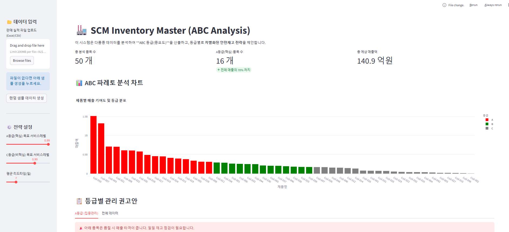

# 🏭 SCM Inventory Master: ABC 재고 분석 및 최적화 솔루션

### 1. 프로젝트 개요 (Overview)
다품종을 생산하는 제조업 환경에서 모든 품목을 동일하게 관리하는 것은 비효율적입니다. 
본 프로젝트는 **파레토 법칙(Pareto Principle)**에 기반한 **ABC 분석**을 자동화하고, 제품 등급별로 차별화된 **안전 재고(Safety Stock) 전략**을 제안하는 웹 기반 솔루션입니다.

단순 감에 의존하던 발주 방식을 탈피하고, **데이터에 기반한 재고 최적화(Optimization)**를 실현하기 위해 개발하였습니다.

### 2. 핵심 로직 및 전략 (Business Logic)
이 시스템은 SCM의 핵심 이론을 알고리즘으로 구현했습니다.

* **ABC Segmentation (선택과 집중):**
    * 매출 기여도가 높은 상위 품목을 자동으로 식별하여 등급(A/B/C)을 부여합니다.
    * **A등급 (핵심):** 품절 비용이 크므로 **서비스 레벨 99%** 유지 (안전재고 확보)
    * **C등급 (비핵심):** 재고 유지 비용 절감을 위해 **서비스 레벨 90%**로 완화

* **Risk Pooling (리스크 관리):**
    * 리드타임(Lead Time)과 수요 변동성(Standard Deviation)을 고려하여, 불확실성에 대응하기 위한 최소한의 안전 재고량을 수학적으로 산출합니다.
    * $$Safety Stock = Z \times \sigma \times \sqrt{Lead Time}$$

### 3. 주요 기능 (Key Features)
1.  **엑셀 데이터 연동:** 현업에서 사용하는 판매 실적 파일(.xlsx, .csv)을 업로드하여 즉시 분석 가능.
2.  **대시보드 시각화:** Plotly를 활용한 반응형 파레토 차트 제공 (Zoom-in/out 가능).
3.  **시나리오 시뮬레이션:** 리드타임이나 목표 서비스 레벨을 슬라이더로 조정하면, 권장 재고량이 어떻게 변하는지 실시간 확인.
4.  **관리 리포트 생성:** 등급별 품목 리스트와 재고 권고안을 표(Table) 형태로 출력.

### 4. 기술 스택 (Tech Stack)
* **Language:** Python 3.9
* **Web Framework:** Streamlit (데이터 앱 구축)
* **Data Analysis:** Pandas (대용량 데이터 처리 및 ABC 분류), NumPy
* **Visualization:** Plotly (인터랙티브 차트 구현)

### 5. 실행 화면 (Demo)

```

```
> * **총 분석 품목:** 50개 (가상 데이터 생성 기능 탑재)
> * **A등급 판정:** 매출 상위 20% 품목 → 집중 관리 대상 선정
> * **성과:** 불필요한 C등급 재고를 줄이고, A등급 품절을 방지하여 재고 회전율 개선 가능성 확인

### 6. 설치 및 실행 방법 (How to run)
```bash
# 1. 필수 라이브러리 설치
pip install streamlit pandas numpy plotly openpyxl

# 2. 애플리케이션 실행
python -m streamlit run scm_pro.py
